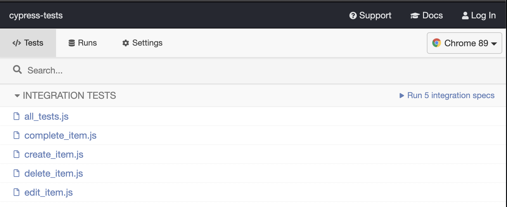
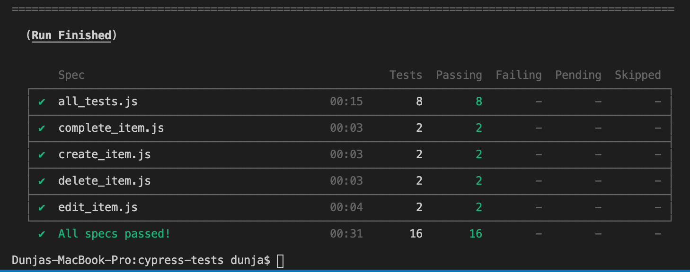

# Cypress integration tests
The purpose of these tests is to check the to-do list web app.

Tests are written using Cypress, a front-end testing tool built for the web app, based on JS. 

The focus of these tests is to see are we able to create, edit, complete, and delete to-dos from the list.

In this README file, although there are many ways to run cypress tests, running tests from GUI and within docker container will be shown.

## Prerequisites

- Node.js version 10.x or 12.x and above

- Install requirements: 

```bash
npm install cypress
```

If we want to run tests within a Docker container, the prerequisite is to have Docker installed.

##  Cypress integration tests project consists of five main parts

1. *cypress* Tests and whole logic are in cypress folder. Fixures, integration, plugins, and support are here.
The integration folder consists of five js files. Each file consists of positive and negative tests related to functionality tests.

In the all_tests file, there are tests for all functionality in one file.

The testing method is a Black box that examines the functionality of an application without peering into code.

2. *cypress.env.json* Env variable "baseUrl" is set in this file. 

3. *cy-run.sh* Script for running tests within Docker container.

4. *cypress.json* When a project is added to Cypress, a cypress.json file is created in the project. 
This file can be used to store any configuration values you supply. For now, it's empty.

5. *README* ReadMe file helps with setup and how to run tests.


## Run the tests

### Run Cypress tests in the interactive GUI
Run a test with (from root cypress-tests directory): 
```bash
$ npx cypress open
```
Cypress GUI app will appear and whole files from the integration folder will be visible. 



Double-click on the file will run tests from that file. 
Cypress runs as fast as your browser can render content. You can watch tests run in real-time.


### Run Cypress tests in Docker container
Run a test with (from root cypress-tests directory): 
```bash
$ ./cy-run.sh
```



After running tests with Docker, videos about all recorded tests will be saved in the cypress folder.
For now, it is in the .gitignore file.


Help: `npx cypress -hh`
